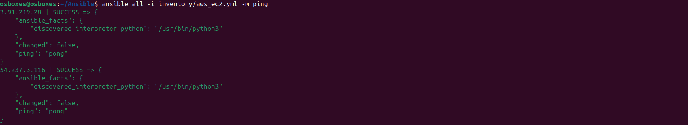
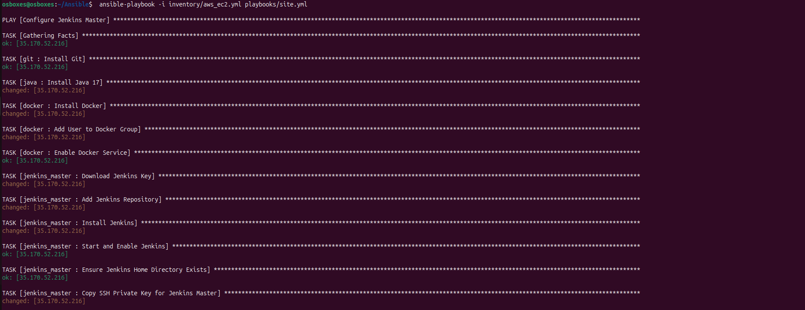
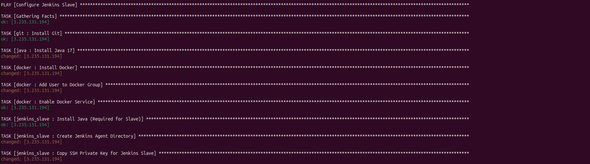
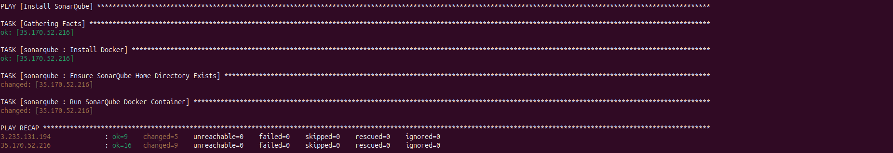
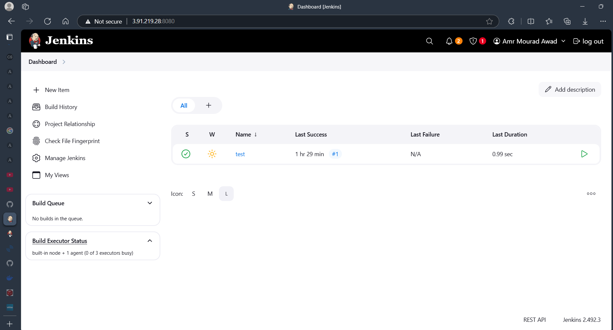
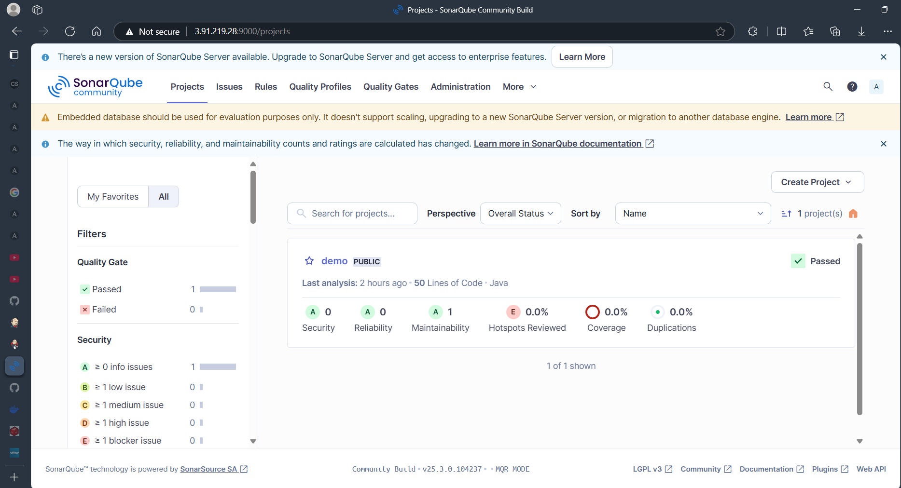

# Ansible

This folder contains Ansible playbooks, roles, and configuration files used for automating infrastructure deployment and management tasks. Below is an overview of what this folder includes:

- **Playbooks**: YAML files that define the tasks to be executed on target systems.
- **Roles**: Modular and reusable units of Ansible configuration, including tasks, handlers, variables, and templates.
- **Dynamic Inventory**: A script or plugin that dynamically generates the inventory of AWS EC2 instances based on tags or other criteria. For example, you can use the `aws_ec2` plugin to fetch instance details. Configure it in `inventory/aws_ec2.yml` with the required AWS credentials and filters.
- **Configuration Files**: Files such as `ansible.cfg` or inventory files that define the environment and settings for Ansible execution.

---

### **Playbooks, Roles, and Inventory**

#### **Playbooks**
The `site.yml` playbook consists of the following plays:

1. **Configure Jenkins Master**:
   - Hosts: `master`
   - Roles:
     - `git`: Installs Git.
     - `java`: Installs Java.
     - `docker`: Installs Docker and configures it.
     - `jenkins_master`: Installs and configures Jenkins as the master node.

2. **Configure Jenkins Slave**:
   - Hosts: `slave`
   - Roles:
     - `git`: Installs Git.
     - `java`: Installs Java.
     - `docker`: Installs Docker and configures it.
     - `jenkins_slave`: Installs and configures Jenkins as the slave node.

3. **Install SonarQube**:
   - Hosts: `master`
   - Roles:
     - `sonarqube`: Installs and configures SonarQube.

#### **Roles**
The following roles are included in the project:

1. **`git`**:
   - Installs Git on the target system.

2. **`java`**:
   - Installs Java on the target system.

3. **`docker`**:
   - Installs Docker.
   - Adds the user to the Docker group.
   - Enables and starts the Docker service.

4. **`jenkins_master`**:
   - Installs Jenkins.
   - Configures Jenkins as the master node.
   - Copies the SSH private key for secure communication.

5. **`jenkins_slave`**:
   - Installs Java (required for the Jenkins slave).
   - Configures the Jenkins slave node.
   - Copies the SSH private key for secure communication.

6. **`sonarqube`**:
   - Installs Docker (if not already installed).
   - Runs the SonarQube Docker container.
   - Ensures the SonarQube service is running.

#### **AWS Inventory**

The AWS inventory is dynamically generated using the `aws_ec2` plugin. It fetches the details of EC2 instances based on specific tags and regions. Below is an overview of the inventory configuration:

1. **Plugin**: The `amazon.aws.aws_ec2` plugin is used to fetch EC2 instance details.
2. **Regions**: The inventory is configured to fetch instances from the `us-east-1` region.
3. **Filters**: Instances are filtered based on their tags, specifically the `Name` tag with values `master` and `slave`.
4. **Hostnames**: The public IP addresses of the instances are used as hostnames.
5. **Keyed Groups**: Instances are grouped based on their tags for easier targeting in playbooks.
6. **Connection Details**:
   - The `ansible_host` is set to the public IP address of the instance.
   - The `ansible_user` is set to `ubuntu` (default for AWS Ubuntu AMIs).
   - The `ansible_ssh_private_key_file` specifies the path to the private key used for SSH access.
   - SSH strict host key checking is disabled for convenience.

---

### Pre-Configurations

Before running the Ansible playbooks, ensure the following pre-configurations are completed:

1. **Install AWS CLI**:
   Download and install the AWS CLI from the [official AWS CLI documentation](https://docs.aws.amazon.com/cli/latest/userguide/install-cliv2.html).

2. **Configure AWS CLI**:
   Run the following command to configure AWS CLI with your credentials:
   ```bash
   aws configure
   ```
   Provide your AWS Access Key, Secret Key, default region, and output format.

3. **Install Python and Pip**:
   Ensure Python and Pip are installed on your system. You can install them using:
   ```bash
   sudo apt update
   sudo apt install python3 python3-pip -y
   ```

4. **Install Required Python Libraries**:
   Use Pip to install the required libraries for AWS dynamic inventory:
   ```bash
   pip install boto boto3 botocore
   ```

5. **Create EC2 Instances**:
   Use the AWS CLI to create two EC2 instances named `master` and `slave`. Example commands:
   ```bash
   aws ec2 run-instances --image-id <ami-id> --count 1 --instance-type t2.micro --key-name <key-name> --tag-specifications 'ResourceType=instance,Tags=[{Key=Name,Value=master}]'
   aws ec2 run-instances --image-id <ami-id> --count 1 --instance-type t2.micro --key-name <key-name> --tag-specifications 'ResourceType=instance,Tags=[{Key=Name,Value=slave}]'
   ```

---

### How to Use

1. Ensure you have Ansible installed on your system.
2. Navigate to this directory.
3. Run the desired playbook using the command:
   ```bash
   ansible-playbook -i inventory/aws_ec2.yml playbooks/site.yml
   ```
4. Customize inventory files and variables as needed for your environment.

---

### Screenshots

Below are the screenshots for the following steps:

1. **Test Ping**:
   Ensure connectivity to the EC2 instances using the Ansible ping module:
   ```bash
   ansible -i inventory/aws_ec2.yml all -m ping
   ```
   

2. **Run Playbook**:
   Execute the playbook to configure Jenkins, Docker, and SonarQube:
   ```bash
   ansible-playbook -i inventory/aws_ec2.yml playbooks/site.yml
   ```
   
   
   


3. **Jenkins Running**:
   Verify Jenkins is running by accessing it in the browser:
   

4. **SonarQube Running**:
   Verify SonarQube is running by accessing it in the browser:
   

---

### Notes

- Make sure to review and update variables in the playbooks or roles to match your infrastructure requirements.