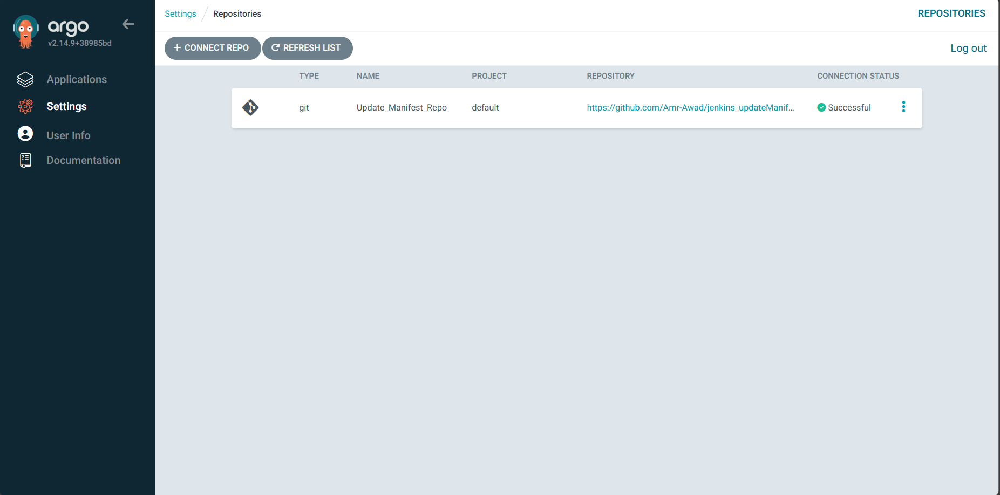
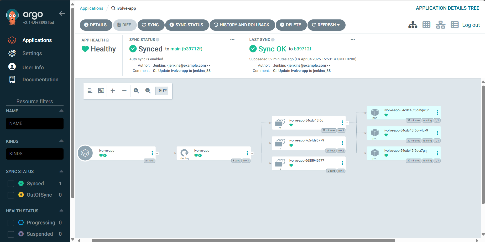
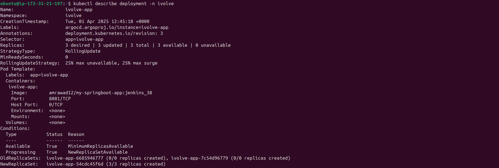

# ArgoCD Application Documentation

This document provides an overview of the ArgoCD application, its functionality, installation steps, and how it monitors the repository for changes to automate deployments.

---

## **Overview**

ArgoCD is a declarative GitOps continuous delivery tool for Kubernetes. It watches a Git repository for changes and automatically synchronizes the desired state of the Kubernetes cluster with the repository.

### **What This Application Does**
1. Watches the `https://github.com/Amr-Awad/jenkins_updateManifest.git` repository for changes in the `main` branch.
2. Deploys the Kubernetes manifests defined in the repository to the `ivolve` namespace.
3. Automatically updates the deployment when changes are pushed to the repository.
4. Ensures the Kubernetes cluster state matches the desired state defined in the repository.

---

## **Installation**

### **Install ArgoCD Using Helm**
1. Add the ArgoCD Helm repository:
   ```bash
   helm repo add argo-cd https://argoproj.github.io/argo-helm
   helm repo update
   ```

2. Install ArgoCD in the `argocd` namespace:
   ```bash
   kubectl create namespace argocd
   helm install argocd argo-cd/argo-cd --namespace argocd
   ```

3. Verify the installation:
   ```bash
   kubectl get pods -n argocd
   ```

### **Install ArgoCD CLI**
1. Download the ArgoCD CLI from the [official releases page](https://github.com/argoproj/argo-cd/releases).
2. Make the binary executable and move it to your PATH:
   ```bash
   chmod +x argocd-linux-amd64
   sudo mv argocd-linux-amd64 /usr/local/bin/argocd
   ```

3. Verify the installation:
   ```bash
   argocd version
   ```

---

## **Connect Repository and Create Application**

1. **Login to ArgoCD**:
   ```bash
   kubectl port-forward svc/argocd-server -n argocd 8080:80
   argocd login localhost:8080
   ```

2. **Add the Git Repository**:
   ```bash
   argocd repo add https://github.com/Amr-Awad/jenkins_updateManifest.git --username <your-username> --password <your-password>
   ```

3. **Create the Application**:
    ```bash
    kubectl apply -f argocd/argo-cd-application.yaml
    ```
---

## **How It Works**

1. **Repository Monitoring**:
   - ArgoCD continuously monitors the `main` branch of the repository.
   - Any changes to the manifests (e.g., `deployment.yaml`) trigger an automatic synchronization.

2. **Deployment**:
   - The `deployment.yaml` file in the repository specifies the desired state of the application.
   - ArgoCD ensures the Kubernetes cluster matches this state.

3. **Self-Healing**:
   - If the cluster state drifts from the desired state, ArgoCD automatically corrects it.

---

## **Screenshots**

1. **GitHub Repository**:
   - Screenshot of the repository being monitored.
   

2. **ArgoCD Application**:
   - Screenshot of the ArgoCD dashboard showing the application.
   

3. **Edited Deployment.yaml**:
   - Screenshot of the updated `deployment.yaml` file in the repository.
   

---

## **Notes**

- Ensure the `argocd` namespace is created before installing ArgoCD.
- Use the `argocd` CLI to manage applications and monitor synchronization status.
- Update the `argo-cd-application.yaml` file to customize the application configuration if needed.
