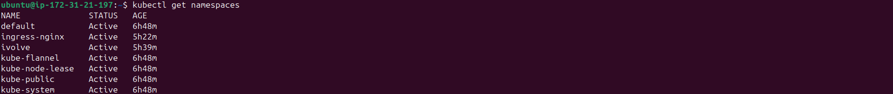
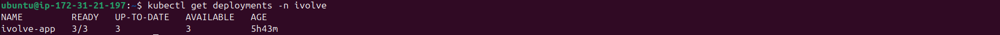
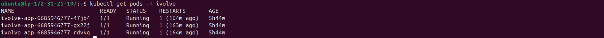
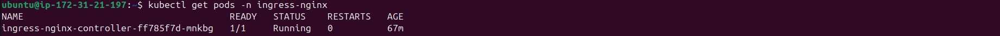
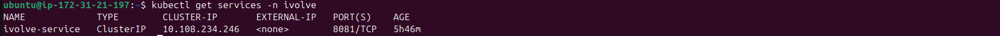
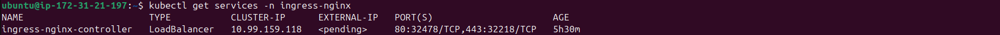
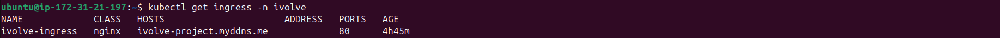
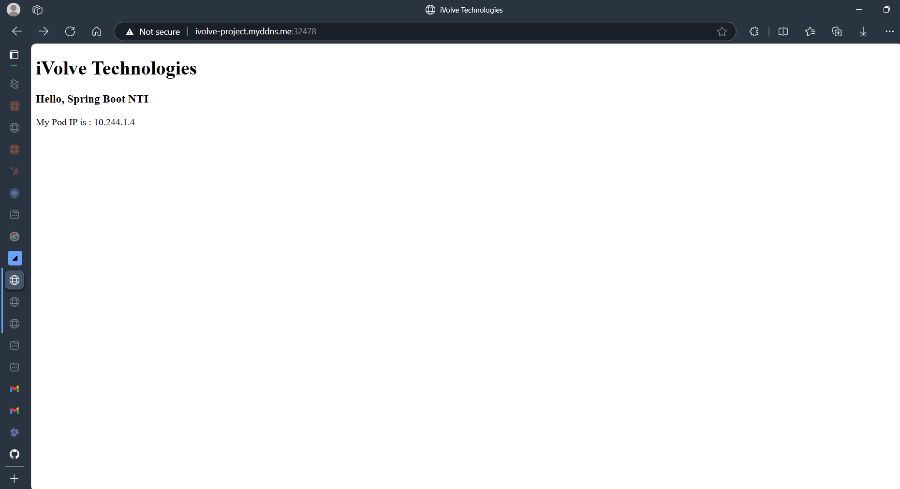
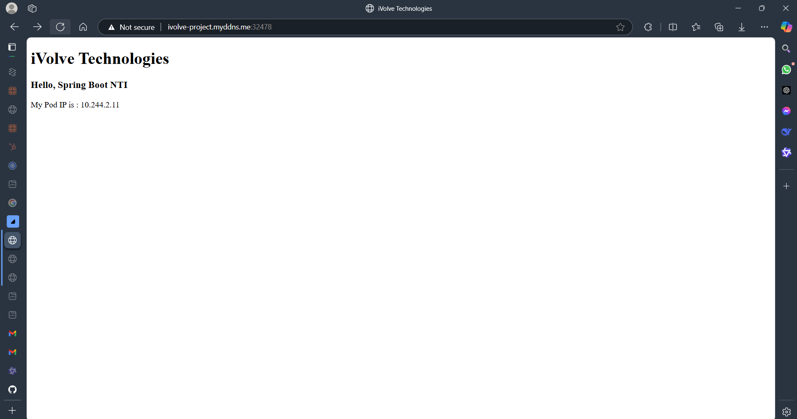

# Kubernetes Cluster Deployment Guide  

This guide provides step-by-step instructions to deploy a Kubernetes cluster on AWS EC2 instances, install required tools, and deploy an application with NGINX Ingress.  

## Prerequisites  
- AWS account with permissions to create EC2 instances.  
- Basic knowledge of Kubernetes and Helm.  

---

## 1. Launch EC2 Instances  

### Master Node  
- **OS**: Ubuntu 22.04 LTS  
- **Instance Type**: t2.medium (2 vCPUs, 4 GiB RAM)  
- **Security Group**:  
    - Allow inbound traffic on:  
        - SSH (22): From your IP.  
        - Kubernetes ports: 6443, 2379-2380, 10250-10252, 30000-32767, 8472/UDP.  

### Worker Nodes  
- **OS**: Ubuntu 22.04 LTS  
- **Instance Type**: t2.small (1 vCPU, 2 GiB RAM)  
- **Security Group**: Same as the master node.  

---

## 2. Configure All Nodes  

### Disable Swap  
```bash  
sudo swapoff -a  
sudo sed -i '/ swap / s/^/#/' /etc/fstab  
```  

### Install Dependencies  
```bash  
sudo apt update && sudo apt upgrade -y  
sudo apt install -y apt-transport-https ca-certificates curl  
```  

### Install Containerd  
```bash  
# Configure kernel modules  
cat <<EOF | sudo tee /etc/modules-load.d/containerd.conf  
overlay  
br_netfilter  
EOF  

sudo modprobe overlay  
sudo modprobe br_netfilter  

# Configure sysctl  
cat <<EOF | sudo tee /etc/sysctl.d/99-kubernetes-cri.conf  
net.bridge.bridge-nf-call-iptables  = 1  
net.ipv4.ip_forward                 = 1  
net.bridge.bridge-nf-call-ip6tables = 1  
EOF  

sudo sysctl --system  

# Install containerd  
curl -fsSL https://download.docker.com/linux/ubuntu/gpg | sudo gpg --dearmor -o /etc/apt/keyrings/docker.gpg  
echo "deb [arch=$(dpkg --print-architecture) signed-by=/etc/apt/keyrings/docker.gpg] https://download.docker.com/linux/ubuntu jammy stable" | sudo tee /etc/apt/sources.list.d/docker.list > /dev/null  
sudo apt update  
sudo apt install -y containerd.io  

# Configure containerd  
sudo mkdir -p /etc/containerd  
containerd config default | sudo tee /etc/containerd/config.toml > /dev/null  
sudo sed -i 's/SystemdCgroup = false/SystemdCgroup = true/' /etc/containerd/config.toml  
sudo systemctl restart containerd  
```  

### Install Kubernetes Tools  
```bash  
# Add Kubernetes repo  
curl -fsSL https://pkgs.k8s.io/core:/stable:/v1.28/deb/Release.key | sudo gpg --dearmor -o /etc/apt/keyrings/kubernetes-apt-keyring.gpg  
echo "deb [signed-by=/etc/apt/keyrings/kubernetes-apt-keyring.gpg] https://pkgs.k8s.io/core:/stable:/v1.28/deb/ /" | sudo tee /etc/apt/sources.list.d/kubernetes.list  
sudo apt update  

# Install kubeadm, kubelet, and kubectl  
sudo apt install -y kubelet kubeadm kubectl  
sudo apt-mark hold kubelet kubeadm kubectl  
```  

---

## 3. Initialize the Master Node  
```bash  
sudo kubeadm init --pod-network-cidr=10.244.0.0/16  

# Set up kubectl  
mkdir -p $HOME/.kube  
sudo cp -i /etc/kubernetes/admin.conf $HOME/.kube/config  
sudo chown $(id -u):$(id -g) $HOME/.kube/config  
```  
**Note**: Save the `kubeadm join` command output for worker nodes.  

---

## 4. Install Pod Network (Flannel)  
```bash  
kubectl apply -f https://raw.githubusercontent.com/flannel-io/flannel/master/Documentation/kube-flannel.yml  
```  

---

## 5. Join Worker Nodes  
On each worker node, run the `kubeadm join` command from the master node output:  
```bash  
sudo kubeadm join <master-ip>:6443 --token <token> --discovery-token-ca-cert-hash <hash>  
```  

---

## 6. Verify the Cluster  
On the master node:  
```bash  
kubectl get nodes  
# Wait until all nodes show Ready status.  
```  

---

## 7. Install NGINX Ingress Controller  
```bash  
# Add the NGINX Ingress Controller Helm repository  
helm repo add ingress-nginx https://kubernetes.github.io/ingress-nginx  

# Update Helm repositories  
helm repo update  

# Install the NGINX Ingress Controller  
helm install ingress-nginx ingress-nginx/ingress-nginx --namespace ingress-nginx --create-namespace  
```  

---

## 8. Copy YAML Files to Control Plane Node  

Use `scp` to copy the `nameSpace.yaml`, `deployment.yaml`, `service.yaml`, and `ingress.yaml` files to the control plane node:  

```bash
scp  -i <key.pem> ./nameSpace.yaml ./deployment.yaml ./service.yaml ./ingress.yaml <user>@<master-ip>:~
```  

Replace `<user>` with your username and `<master-ip>` with the IP address of the control plane node.  

## 9. Update Ingress Host  

Edit the `ingress.yaml` file to update the host with your domain or IP address:  

```yaml
spec:
    rules:
    - host: <your-host>
        http:
            paths:
            - path: /
                pathType: Prefix
                backend:
                    service:
                        name: <service-name>
                        port:
                            number: <port-number>
```

Replace `<your-host>` with your domain or IP address, `<service-name>` with the name of your service, and `<port-number>` with the service port.  

Apply the updated `ingress.yaml` file:  

```bash
kubectl apply -f ./ingress.yaml
```
## 10. Deploy the Application  

### Namespace  
```bash  
kubectl apply -f ./nameSpace.yaml
```  

### Deployment  
```bash  
kubectl apply -f ./deployment.yaml
```  

### Service  
```bash  
kubectl apply -f ./service.yaml
```  

### Ingress  
```bash  
kubectl apply -f ./ingress.yaml
```  

---

## 11. Verify Deployment  

### Check Namespace  
```bash  
kubectl get namespace  
```  

### Check Deployment  
```bash  
kubectl get deployment -n ivolve  
```  

### Check Pods  
```bash  
kubectl get pods -n ivolve  
```  

### Check Services  
```bash  
kubectl get svc -n ivolve  
```  

### Check Ingress  
```bash  
kubectl get ingress -n ivolve  
```  

---

## 12. Access the Application  
Visit The DNS  in your browser.  

---

## 13. Screenshots  
- ### Namespace 
- ### Deployment 
- ### iVolve Pods 
- ### nginx Pods 
- ### iVolve Service 
- ### nginx Service 
- ### Ingress 
- ### Working application from first pod
- ### Working application from second pod
- ### Working application from third pod

- Working application  [Working Application Screenshot](#)  

---  
**Note**: Replace placeholders like `<master-ip>`, `<token>`, and `<hash>` with actual values.  