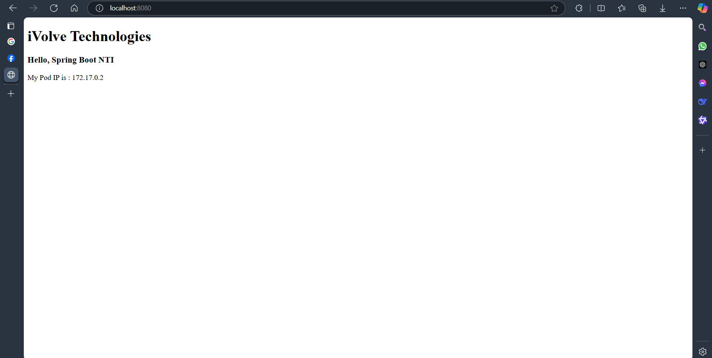

# Docker Documentation

This document provides an overview of the Dockerfile, the purpose of the `.dockerignore` file, prerequisites, and steps to build and run the Docker container for the Spring Boot application.

---

## **Overview**

The Dockerfile is a multi-stage build file designed to create a lightweight and efficient Docker image for the Spring Boot application. It uses Gradle for building the application and a JRE for running it.

---

## **Dockerfile Explanation**

1. **Build Stage**:
   - **Base Image**: `gradle:jdk17-alpine` is used as the base image for the build stage.
   - **Working Directory**: The working directory is set to `/app`.
   - **Copy Files**: Gradle wrapper, build files, and source code are copied to the container.
   - **Build Application**:
     - Gradle dependencies are downloaded to leverage caching.
     - The application is built using Gradle.

2. **Runtime Stage**:
   - **Base Image**: `eclipse-temurin:17-jre-alpine` is used for a smaller runtime image.
   - **Working Directory**: The working directory is set to `/app`.
   - **Copy Built JAR**: Only the built JAR file is copied from the build stage to reduce the image size.
   - **Run Application**: The application is run using the `java -jar` command.

---

## **Purpose of `.dockerignore`**

The `.dockerignore` file is used to exclude unnecessary files and directories from being copied into the Docker image, reducing the image size and build time. It includes:
- Gradle build output (`/build`, `/.gradle`).
- IDE/editor-specific files (`/.idea`, `*.iml`, `*.log`).
- OS-specific and temporary files (`*.swp`, `.DS_Store`).

---

## **Prerequisites**

1. **Install Docker**:
   - Ensure Docker is installed and running on your system.
   - Refer to the [official Docker installation guide](https://docs.docker.com/get-docker/).

2. **Verify Docker Installation**:
   - Run the following command to verify Docker is installed:
     ```bash
     docker --version
     ```

3. **Clone the Repository**:
   - Clone the repository containing the Dockerfile and application source code.

---

## **How to Build and Run the Docker Container**

1. **Build the Docker Image**:
   - Run the following command to build the Docker image:
     ```bash
     docker build -t my-springboot-app .
     ```
   - Replace `my-springboot-app` with your desired image name.

2. **Run the Docker Container**:
   - Run the following command to start the container:
     ```bash
     docker run -d -p 8081:8081 --name springboot-container my-springboot-app
     ```
   - Replace `my-springboot-app` with your image name.

3. **Access the Application**:
   - Open a browser and navigate to `http://localhost:8081` to access the application.

4. **Stop and Remove the Container**:
   - To stop the container:
     ```bash
     docker stop springboot-container
     ```
   - To remove the container:
     ```bash
     docker rm springboot-container
     ```

---

## **Screenshots**

1. **Building the Docker Image**:
   - Screenshot of the terminal output during the image build process.
   

2. **Running the Docker Container**:
   - Screenshot of the terminal output showing the container running.
   

3. **Accessing the Application**:
   - Screenshot of the application running in the browser.
   

---

## **Notes**

- Ensure the application port in the Dockerfile (`8081`) matches the port exposed in the container.
- Use the `docker ps` command to list running containers.
- Use the `docker images` command to list available Docker images.
