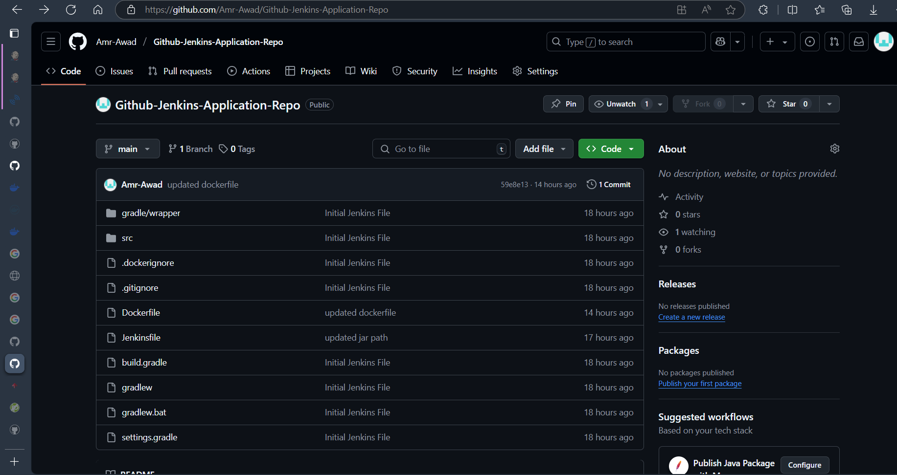
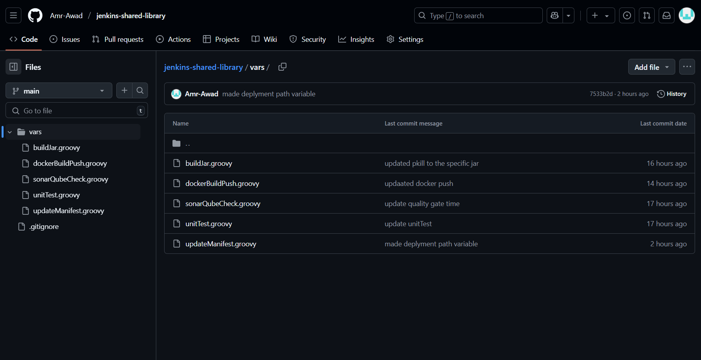
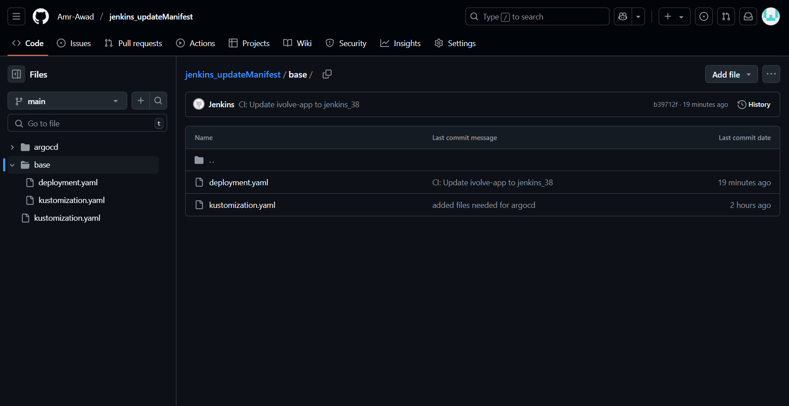
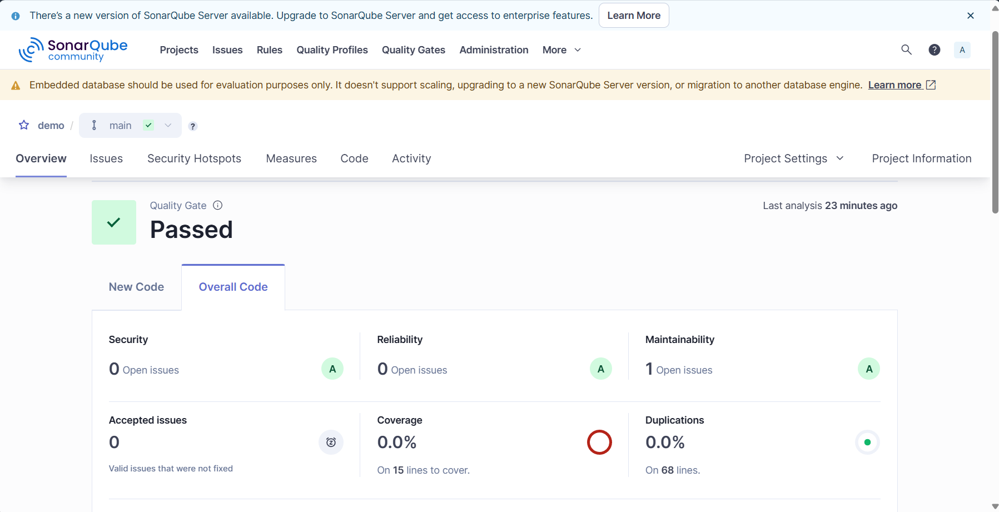
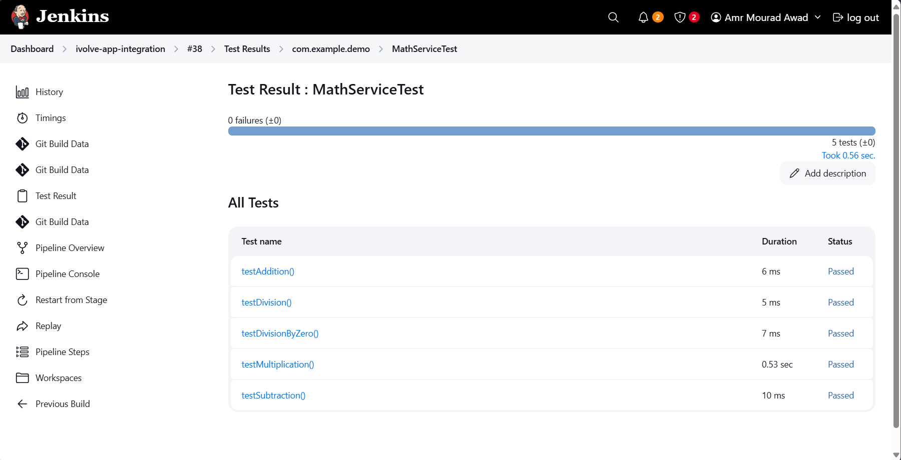
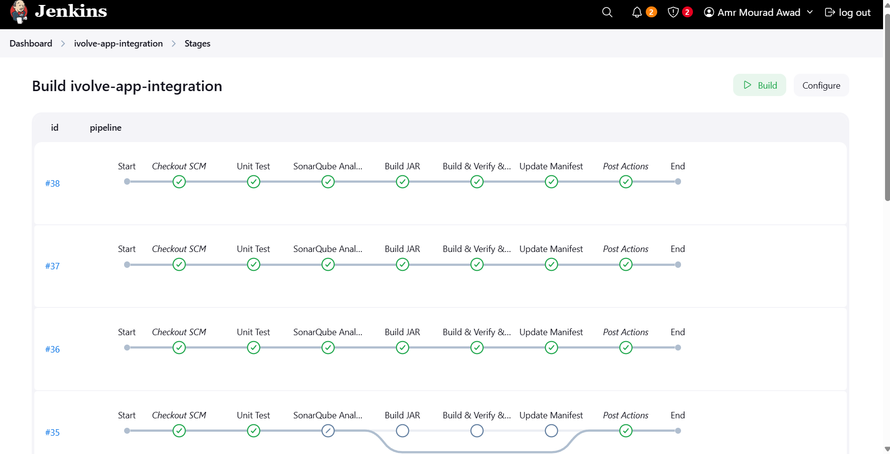

# Jenkins Pipeline Documentation

This document provides an overview of the Jenkins pipeline, its stages, prerequisites, required plugins, credentials, and screenshots of the pipeline execution.

---

## **Pipeline Overview**

The Jenkins pipeline is designed to automate the CI/CD process for a Spring Boot application. It consists of the following stages:

1. **Unit Test**:
   - Executes unit tests using Gradle.
   - Verifies that all tests pass successfully.

2. **SonarQube Analysis**:
   - Performs static code analysis using SonarQube.
   - Ensures the code meets the quality gate criteria.

3. **Build JAR**:
   - Builds the Spring Boot application into a JAR file using Gradle.
   - Verifies the JAR file is created successfully.

4. **Build, Verify, and Push Docker Image**:
   - Builds a Docker image for the application.
   - Runs the container to verify it works as expected.
   - Pushes the Docker image to Docker Hub.

5. **Update Manifest**:
   - Updates the Kubernetes deployment manifest with the new Docker image tag.
   - Commits and pushes the changes to the manifest repository.

---

## **Prerequisites**

### **Required Plugins**
Ensure the following plugins are installed in Jenkins:
1. **Pipeline**: For creating and managing pipelines.
2. **Git**: For cloning repositories.
3. **Gradle**: For building the application and running tests.
4. **SonarQube Scanner**: For static code analysis.
5. **Docker Pipeline**: For building and pushing Docker images.
6. **JUnit**: For parsing and displaying test results.

### **Required Credentials**
1. **GitHub Token**:
   - ID: `github_token`
   - Used for accessing the GitHub repositories.
2. **Docker Hub Token**:
   - ID: `docker_token`
   - Used for pushing Docker images to Docker Hub.

### **Environment Variables**
The following environment variables are configured in the Jenkinsfile:
- `DOCKERHUB_CREDENTIALS`: Docker Hub credentials ID.
- `GIT_CREDENTIALS`: GitHub credentials ID.
- `DOCKER_IMAGE`: Docker image name (e.g., `amrawad12/my-springboot-app`).
- `MANIFEST_REPO`: URL of the manifest repository.
- `JAR_FILE`: Path to the built JAR file.

---

## **Repositories**

1. **Main Repository**:
   - Contains the source code and Jenkinsfile.
   - URL: [Main Repository](https://github.com/Amr-Awad/Github-Jenkins-Application-Repo)
     

2. **Shared Library Repository**:
   - Contains the shared library used in the pipeline.
   - URL: [Shared Library Repository](https://github.com/Amr-Awad/jenkins-shared-library)
    

3. **Manifest Repository**:
   - Contains the Kubernetes deployment manifests.
   - URL: [Manifest Repository](https://github.com/Amr-Awad/jenkins_updateManifest)
    

---

## **Pipeline Execution**

### **Screenshots**

1. **SonarQube Analysis**:
   - Screenshot of SonarQube dashboard showing the analysis results.
   

2. **Unit Tests**:
   - Screenshot of the Jenkins console output showing successful unit test execution.
   

3. **Pipeline Execution**:
   - Screenshot of the Jenkins pipeline view showing all stages executed successfully.
   

4. **Manifest Update**:
   - Screenshot of the GitHub repository showing the updated deployment manifest.
   

---

## **How to Run the Pipeline**

1. Clone the main repository to your Jenkins workspace:
    - URL: [Main Repository](https://github.com/Amr-Awad/Github-Jenkins-Application-Repo)

2. Configure the required credentials in Jenkins:
    - Add the GitHub token with ID `github_token`.
    - Add the Docker Hub token with ID `docker_token`.
3. Ensure the required plugins are installed.
4. Trigger the pipeline from the Jenkins dashboard.

---

## **Notes**

- Ensure Docker is installed and running on the Jenkins agent.
- Verify that the SonarQube server is configured in Jenkins.
- Update the environment variables in the Jenkinsfile to match your setup.
