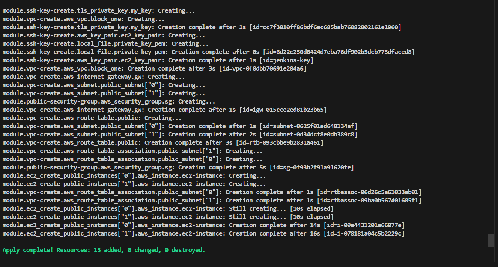
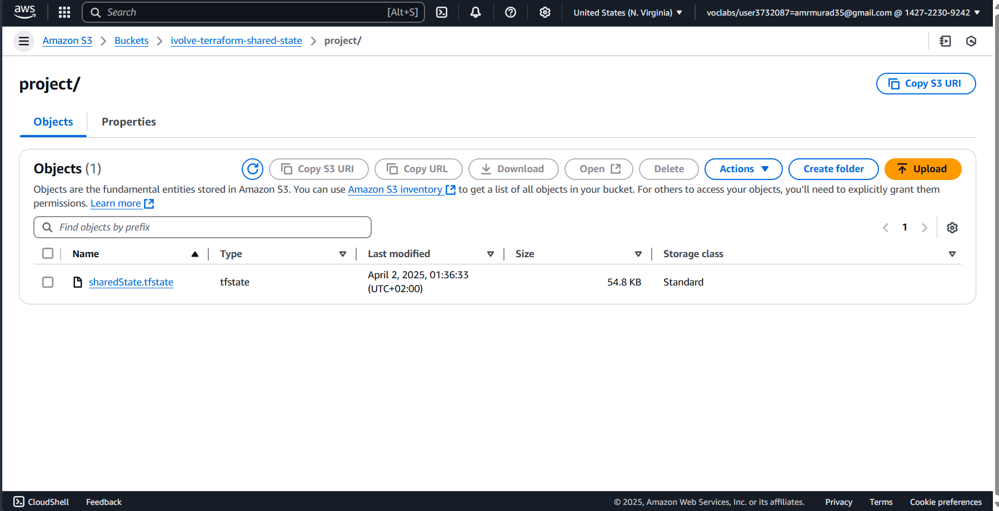
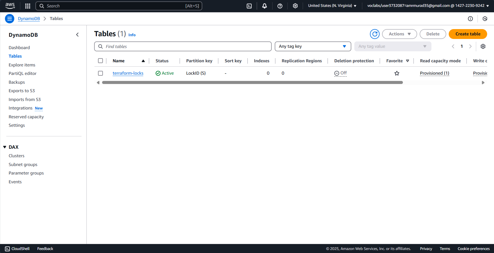
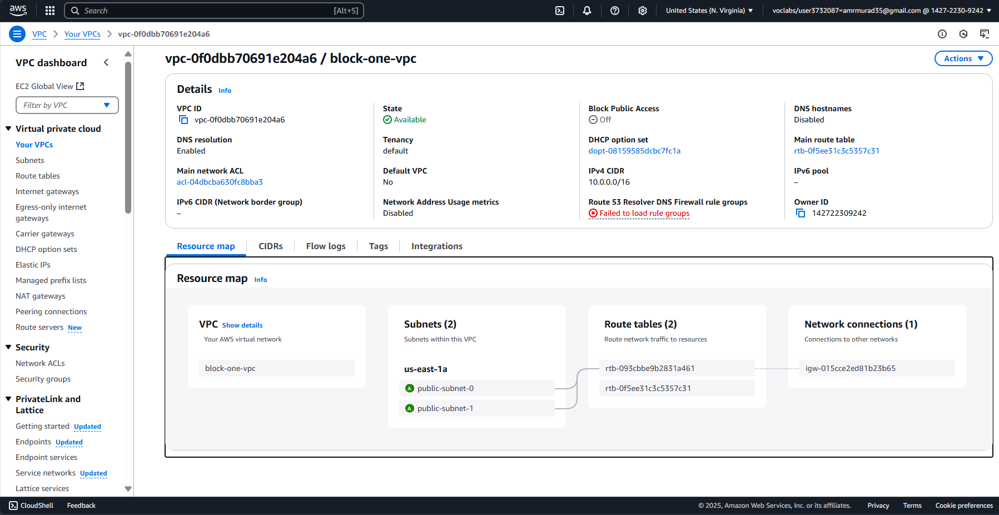
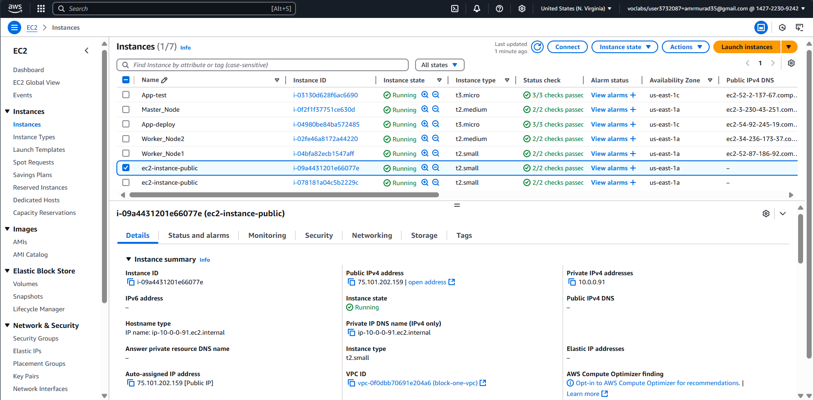
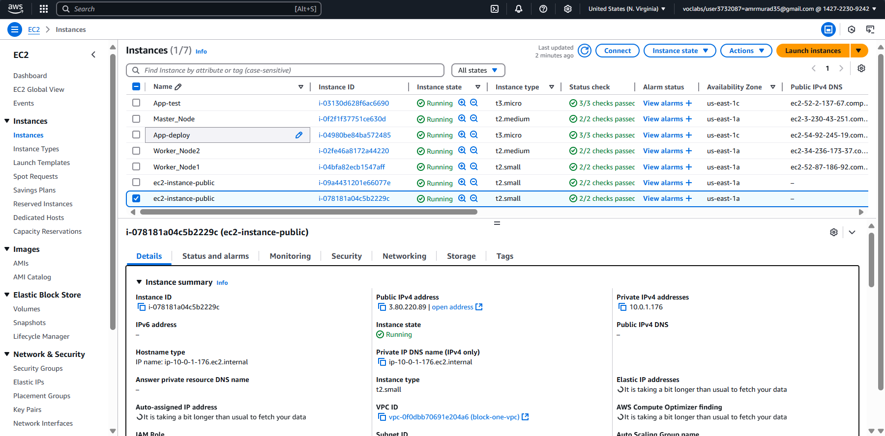

# Terraform Project Documentation

## Infrastructure Overview

This Terraform configuration creates the following infrastructure:

- **VPC**: A Virtual Private Cloud with a CIDR block of `10.0.0.0/16`, including two public subnets.
- **EC2 Instances**: Two public EC2 instances using the `t2.small` instance type, each with a public IP address and SSH access enabled.
- **Security Groups**: A security group allowing inbound traffic on ports 22 (SSH), 80 (HTTP), and 443 (HTTPS) from any IP address.
- **SSH Key Pair**: A key pair for secure access to the EC2 instances.
- **S3 Bucket and DynamoDB Table**: Used for storing the Terraform state and enabling state locking.

## Project Structure

The project is organized as follows:

```
Terraform/
├── modules/
│   ├── ec2-module/
│   │   ├── main.tf
│   │   ├── output.tf
│   │   └── variables.tf
│   ├── security-groups-module/
│   │   ├── main.tf
│   │   ├── output.tf
│   │   └── variables.tf
│   ├── ssh-key-module/
│   │   ├── main.tf
│   │   ├── output.tf
│   │   └── variables.tf
│   └── vpc-module/
│       ├── main.tf
│       ├── output.tf
│       └── variables.tf
├── ec2-create.tf
├── security-group-create.tf
├── sharedState.tf
├── ssh-key-create.tf
└── vpc-create.tf
```

## Prerequisites

1. **Install AWS CLI**:
    - Download and install the AWS CLI from [AWS CLI Installation Guide](https://docs.aws.amazon.com/cli/latest/userguide/install-cliv2.html).

2. **Configure AWS CLI**:
    - Run `aws configure` and provide your AWS Access Key, Secret Key, default region, and output format.

3. **Create S3 Bucket and DynamoDB Table for Shared State**:
    - Create an S3 bucket to store the Terraform state file:
      ```bash
      aws s3api create-bucket --bucket ivolve-terraform-shared-state --region us-east-1
      ```
    - Enable versioning on the S3 bucket:
      ```bash
      aws s3api put-bucket-versioning --bucket ivolve-terraform-shared-state --versioning-configuration Status=Enabled
      ```
    - Create a DynamoDB table for state locking:
      ```bash
      aws dynamodb create-table \
         --table-name terraform-locks \
         --attribute-definitions AttributeName=LockID,AttributeType=S \
         --key-schema AttributeName=LockID,KeyType=HASH \
         --provisioned-throughput ReadCapacityUnits=1,WriteCapacityUnits=1
      ```

4. **Clone the Repository**:
    - Clone the Terraform project repository:
      ```bash
      git clone <repository-url>
      ```
    - Navigate to the Terraform directory:
      ```bash
      cd Resources/Terraform
      ```

## Backend Configuration

The `sharedState.tf` file configures the S3 bucket as the backend for Terraform state:

```hcl
terraform {
  backend "s3" {
     bucket         = "ivolve-terraform-shared-state"
     key            = "project/sharedState.tfstate"
     region         = "us-east-1"
     dynamodb_table = "terraform-locks"
  }
}
```

## Applying the Terraform Configuration

1. Initialize the Terraform project:
    ```bash
    terraform init
    ```

2. Validate the configuration:
    ```bash
    terraform validate
    ```

3. Plan the infrastructure changes:
    ```bash
    terraform plan
    ```

4. Apply the changes:
    ```bash
    terraform apply
    ```

## Screenshots

- **Applying on Terraform**:
  

- **S3 Bucket**:
  

- **DynamoDB Table**:
  

- **VPC**:
  

- **EC2 First Instance**:
  

- **EC2 Second Instance**:
  

## Notes

- Ensure the AWS credentials used have sufficient permissions to create the required resources.
- The `sharedState.tf` file ensures that the Terraform state is stored securely and supports state locking to prevent concurrent modifications.
- Modify the `*-create.tf` files in each module to customize the infrastructure as needed.
- The infrastructure is designed to be modular, allowing easy updates and scalability.
