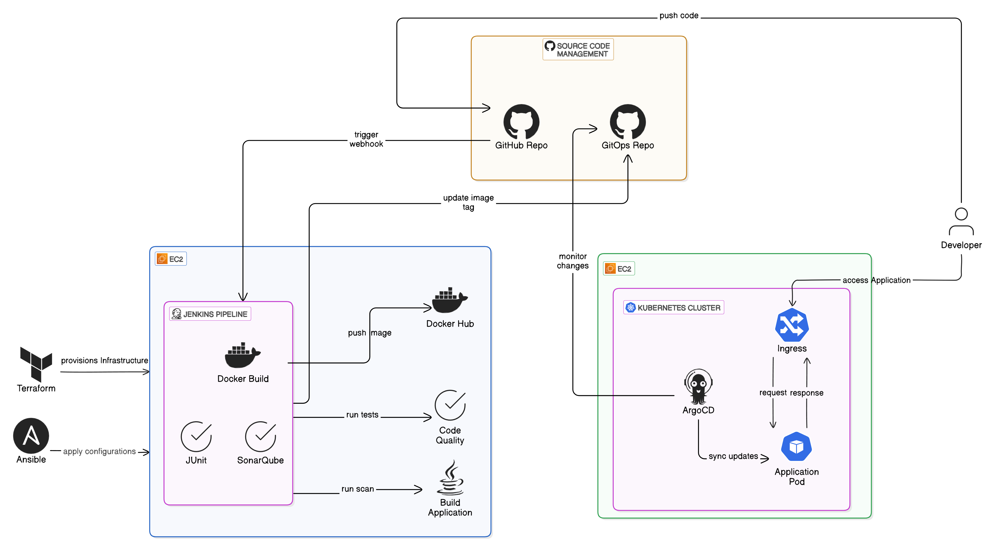

# iVolve Graduation Project Documentation

This document provides an overview of the entire project, detailing the tools used, their purposes, and how they are integrated to achieve the project's goals. Each tool's folder contains more detailed documentation.

---

## **Project Overview**

The iVolve Graduation Project is a comprehensive DevOps pipeline designed to automate the deployment and management of a Spring Boot application. The project integrates multiple tools and technologies to achieve Continuous Integration (CI), Continuous Delivery (CD), and infrastructure automation.

---

## **Architechture Diagram**

## **Tools and Their Roles**

### 1. **Docker**
- **Purpose**: Containerizes the Spring Boot application for consistent deployment across environments.
- **Key Features**:
  - Multi-stage Dockerfile for efficient image creation.
  - Runs the application in a lightweight container.
- **Integration**: Provides a portable runtime environment for the application.
- **Details**: [Docker Documentation](./Resources/Docker/readme.md)

---

### 2. **Terraform**
- **Purpose**: Automates the provisioning of cloud infrastructure on AWS.
- **Key Features**:
  - Creates a Virtual Private Cloud (VPC), EC2 instances, security groups, and an S3 bucket for Terraform state.
  - Modular structure for scalability and reusability.
- **Integration**: Provides the foundational infrastructure for the entire pipeline.
- **Details**: [Terraform Documentation](./Resources/Terraform/readme.md)

---

### 3. **Ansible**
- **Purpose**: Automates the configuration of Jenkins, Docker, and SonarQube on AWS EC2 instances.
- **Key Features**:
  - Configures Jenkins master and slave nodes.
  - Installs and configures SonarQube for static code analysis.
- **Integration**: Ensures consistent and repeatable configuration of tools.
- **Details**: [Ansible Documentation](./Ansible/readme.md)

---

### 4. **Kubernetes**
- **Purpose**: Manages the deployment and scaling of the Spring Boot application.
- **Key Features**:
  - Deploys the application using YAML manifests for namespace, deployment, service, and ingress.
  - Uses NGINX Ingress for routing traffic to the application.
- **Integration**: Hosts the application in a scalable and reliable environment.
- **Details**: [Kubernetes Documentation](./Kubernetes/readme.md)

---

### 5. **Jenkins**
- **Purpose**: Automates the CI/CD pipeline for the Spring Boot application.
- **Key Features**:
  - Runs unit tests, performs static code analysis with SonarQube, builds Docker images, and updates Kubernetes manifests.
  - Integrates with Docker, SonarQube, and GitHub.
- **Integration**: Orchestrates the entire CI/CD process.
- **Details**: [Jenkins Documentation](./Jenkins/readme.md)

---

### 6. **ArgoCD**
- **Purpose**: Implements GitOps for Kubernetes by automating the synchronization of manifests from a Git repository.
- **Key Features**:
  - Monitors the Git repository for changes and updates the Kubernetes cluster accordingly.
  - Ensures the cluster state matches the desired state defined in the repository.
- **Integration**: Automates the deployment process and ensures consistency.
- **Details**: [ArgoCD Documentation](./ArgoCD/readme.md)

---

## **How the Tools Work Together**

1. **Infrastructure Provisioning**:
   - Terraform provisions the AWS infrastructure, including EC2 instances, VPC, and security groups.

2. **Configuration Management**:
   - Ansible configures the EC2 instances with Jenkins, Docker, and SonarQube.

3. **CI/CD Pipeline**:
   - Jenkins automates the CI/CD process:
     - Runs unit tests and static code analysis.
     - Builds a Docker image and pushes it to Docker Hub.
     - Updates Kubernetes manifests in the Git repository.

4. **Containerization**:
   - Docker ensures the application runs in a consistent environment.

5. **Application Deployment**:
   - Kubernetes deploys the application using the updated manifests.
   - NGINX Ingress routes traffic to the application.

6. **GitOps**:
   - ArgoCD monitors the Git repository for changes and synchronizes the Kubernetes cluster with the desired state.

---

## **Project Workflow**

1. **Provision Infrastructure**:
   - Use Terraform to create the required AWS resources.

2. **Configure Instances**:
   - Use Ansible to set up Jenkins, Docker, and SonarQube on the EC2 instances.

3. **Run CI/CD Pipeline**:
   - Trigger the Jenkins pipeline to build, test, and deploy the application.

4. **Deploy Application**:
   - Use Kubernetes to deploy the application and expose it via NGINX Ingress.

5. **Monitor and Synchronize**:
   - Use ArgoCD to ensure the Kubernetes cluster state matches the desired state in the Git repository.

---

## **Links to Tool-Specific Documentation**

- [Terraform Documentation](./Resources/Terraform/readme.md)
- [Jenkins Documentation](./Resources/Jenkins/readme.md)
- [Kubernetes Documentation](./Kubernetes/readme.md)
- [Ansible Documentation](./Resources/Ansible/readme.md)
- [Docker Documentation](./Resources/Docker/readme.md)
- [ArgoCD Documentation](./Resources/ArgoCD/readme.md)

---

## **Notes**

- Ensure all prerequisites for each tool are met before starting the workflow.
- Follow the detailed instructions in each tool's documentation for setup and usage.
- The project is designed to be modular, allowing easy updates and scalability.
